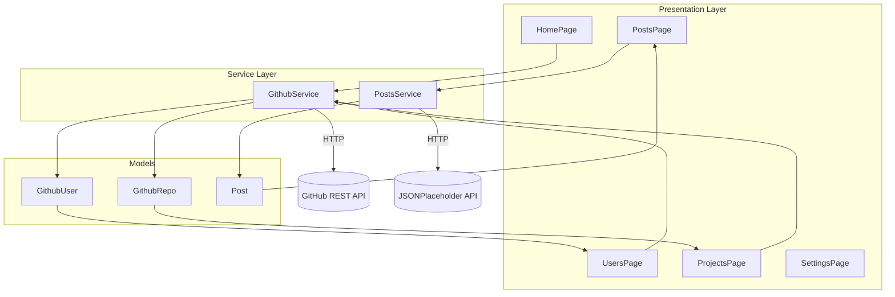
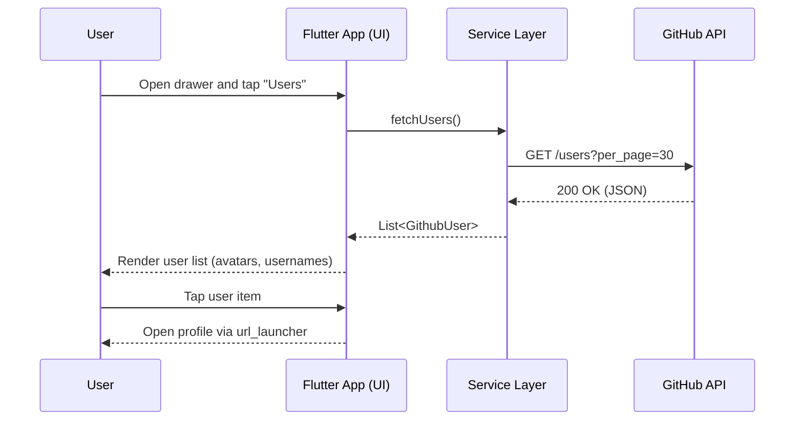
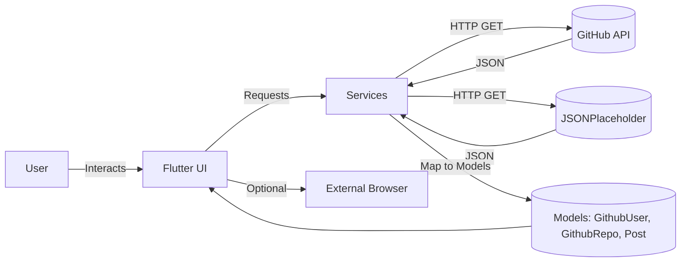

# 🚀 GitHub Explorer App (Flutter) ✨

Explore GitHub users and repositories with a clean Flutter interface, and experiment with REST calls using JSONPlaceholder. Multi-platform by default: Android, iOS, Web, Windows, macOS, and Linux.

---

## 📚 Table of Contents
- **Overview**
- **Key Features**
- **Tech Stack**
- **Project Structure**
- **Screens**
- **APIs Used**
- **Getting Started**
- **Future Improvements**
- **Diagrams (Mermaid)**
- **License**

---

## 🧭 Overview
GitHub Explorer App is a Flutter application that demonstrates practical API integration and UI patterns:
- Browse public GitHub users
- View repositories for a given GitHub username
- Read sample posts from JSONPlaceholder

The app is organized with a simple, maintainable structure (Pages → Services → Models), using `http` for networking and `url_launcher` to open external links.

---

## 🔑 Key Features
- **Home**: Friendly welcome screen with a navigation drawer.
- **Projects**: List repositories for a configured GitHub username (default: `saidouchrif`).
- **Users**: Browse public GitHub users; open profiles in the browser.
- **Posts**: Fetch and display posts from JSONPlaceholder.
- **Settings**: UI-only toggles (Dark Mode, Language), About dialog, Clear cache snackbar.
- **Multi-platform**: Runs on mobile, web, and desktop with a single codebase.

---

## 🧰 Tech Stack

| Layer | Tools / Packages |
| --- | --- |
| Framework | Flutter 3 (Material Design) |
| Language | Dart (SDK `^3.8.1`) |
| Networking | `http: ^1.2.0` |
| Utilities | `url_launcher: ^6.2.6`, `cupertino_icons` |
| APIs | GitHub REST API v3, JSONPlaceholder |
| Platforms | Android, iOS, Web, Windows, macOS, Linux |

---

## 🗂️ Project Structure

```text
github_api_flutter_app/
├─ lib/
│  ├─ main.dart
│  ├─ models/
│  │  ├─ github_repo.dart
│  │  ├─ github_user.dart
│  │  └─ post.dart
│  ├─ services/
│  │  ├─ github_service.dart        # GitHub API calls (users, repos)
│  │  └─ posts_service.dart         # JSONPlaceholder posts
│  └─ pages/
│     ├─ Home/
│     │  └─ home_page.dart
│     ├─ Projects/
│     │  └─ project_page.dart
│     ├─ Users/
│     │  └─ users_page.dart
│     ├─ Posts/
│     │  └─ posts_page.dart
│     ├─ Settings/
│     │  └─ settings_page.dart
│     └─ Contact/                   # optional demo screens
│        ├─ contact_page.dart
│        ├─ contact_add.dart
│        └─ cantact_update.dart
├─ images/
│  └─ profile.png                   # used in drawer avatar
├─ pubspec.yaml                      # deps and assets
└─ test/                             # tests (placeholder)
```

---

## 📱 Screens
- **🏠 Home**
  - Navigation drawer to Users, Projects, Posts, Contact, and Settings.
  - Welcome card with subtle gradient styling.

- **📦 Projects**
  - Fetches repositories for a configured username via `GithubService.fetchUserRepos()`.
  - Displays name, description, and language with a GitHub icon.
  - Default username: `saidouchrif` (see Configuration below to change).

- **👤 Users**
  - Calls GitHub API to list public users (`/users?per_page=30`).
  - Tapping a user opens their profile in the system browser using `url_launcher`.

- **📰 Posts**
  - Loads posts from JSONPlaceholder (`/posts`).
  - Simple card-based list UI for title and body.

- **⚙️ Settings**
  - UI-only toggles for Dark Mode and Language selection.
  - About dialog and a demo "Clear Cache" action (snackbar).

---

## 🌐 APIs Used
- **GitHub REST API v3**
  - `GET https://api.github.com/users?per_page=30`
  - `GET https://api.github.com/users/{username}/repos`
  - Headers used: `Accept: application/vnd.github+json`, `X-GitHub-Api-Version: 2022-11-28`
  - Note: Requests are unauthenticated by default and subject to rate limits.

- **JSONPlaceholder**
  - `GET https://jsonplaceholder.typicode.com/posts`
  - Public fake REST API for testing and prototyping.

---

## 🚀 Getting Started

### Prerequisites
- Flutter SDK installed and configured
- A device/emulator or a supported desktop/web target

### Installation
```bash
# 1) Clone the repository
git clone https://github.com/<your-username>/github_api_flutter_app.git

# 2) Enter the project directory
cd github_api_flutter_app

# 3) Fetch dependencies
flutter pub get
```

### Run
```bash
# Launch on the best available device
flutter run

# Or target a specific device
flutter devices
flutter run -d chrome        # Web
flutter run -d windows       # Windows Desktop
flutter run -d macos         # macOS Desktop
flutter run -d linux         # Linux Desktop
```

### Configuration (optional)
- Change the default GitHub username used on the Projects screen:
  - File: `lib/pages/Projects/project_page.dart`
  - Line: inside `initState()`

```dart
@override
void initState() {
  super.initState();
  _futureRepos = _githubService.fetchUserRepos('<your-github-username>');
}
```

---

## 🧭 Diagrams (Mermaid)

### 1) Architecture Diagram


### 2) Workflow Diagram


### 3) Data Flow Diagram (DFD)


---

## 🛣️ Future Improvements
- Authentication with GitHub token (to raise rate limits)
- Repository details screen (stars, forks, topics, README preview)
- Search and filtering for users and repositories
- Pagination and caching for smoother scrolling
- Global dark mode with state management (e.g., Provider/BLoC)
- Error handling, retries, and offline support
- Unit/widget tests and CI/CD pipeline
- Localization (i18n)

---

## 📄 License
MIT License

Copyright (c) 2025 Said Ouchrif

Permission is hereby granted, free of charge, to any person obtaining a copy
of this software and associated documentation files (the "Software"), to deal
in the Software without restriction, including without limitation the rights
to use, copy, modify, merge, publish, distribute, sublicense, and/or sell
copies of the Software, and to permit persons to whom the Software is
furnished to do so, subject to the following conditions:

The above copyright notice and this permission notice shall be included in all
copies or substantial portions of the Software.

THE SOFTWARE IS PROVIDED "AS IS", WITHOUT WARRANTY OF ANY KIND, EXPRESS OR
IMPLIED, INCLUDING BUT NOT LIMITED TO THE WARRANTIES OF MERCHANTABILITY,
FITNESS FOR A PARTICULAR PURPOSE AND NONINFRINGEMENT. IN NO EVENT SHALL THE
AUTHORS OR COPYRIGHT HOLDERS BE LIABLE FOR ANY CLAIM, DAMAGES OR OTHER
LIABILITY, WHETHER IN AN ACTION OF CONTRACT, TORT OR OTHERWISE, ARISING FROM,
OUT OF OR IN CONNECTION WITH THE SOFTWARE OR THE USE OR OTHER DEALINGS IN THE
SOFTWARE.
